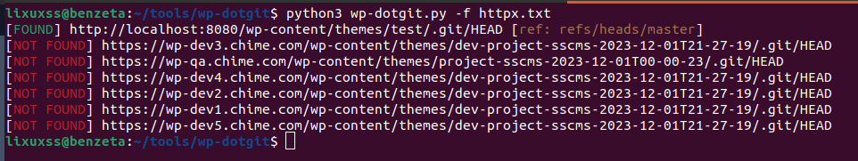

<h1 align="center">WP Dotgit<br></h1>

`wp-dotgit.py` This Python script checks if a WordPress website has a Git repository exposed in its theme. 



## Requirements

```sh
pip install -r requirements.txt
```
<br>

# Usage

Check a single WordPress site:

```sh
python3 wp-dotgit.py -u https://example.com
```
Check multiple WordPress sites from a text file:

```sh
python3 wp-dotgit.py -f urls.txt
```
<br>

This will display help for the tool. Here are all the switches it supports.

```console
usage: wp-dotgit.py [-h] [-u URL] [-f FILE]

options:
  -h, --help            show this help message and exit
  -u URL, --url URL     URL to retrieve the WordPress theme.
  -f FILE, --file FILE  Text file containing a list of URLs to process.
```

<br>
 